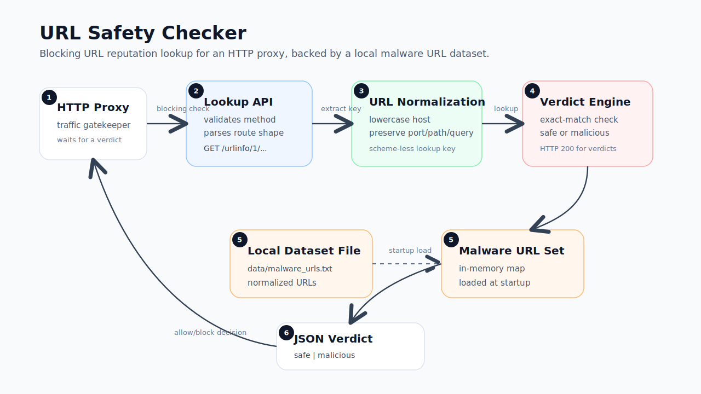

# Design: URL Lookup Service

## 1. Problem

An HTTP proxy checks a requested URL before allowing access. This service
receives the URL lookup request and returns a safety verdict.

## 2. Requirements

- Expose `GET /urlinfo/1/{hostname_and_port}/{original_path_and_query_string}`.
- Return whether the URL is known to be malicious.
- Return `200 OK` for both safe and malicious verdicts.
- Return `400` for malformed lookup requests.
- Return `405` for unsupported methods.
- Run locally on macOS and Linux.
- Include automated tests and run instructions.
- Include notes for scaling, operations, lifecycle, and deployment.

## 3. Project Structure

```text
cmd/urlinfo/
  main.go              server startup and dependency wiring

internal/httpapi/
  handler.go           HTTP routes, request parsing, JSON responses
  handler_test.go      handler tests

internal/lookup/
  normalize.go         URL key normalization
  normalize_test.go    normalization tests
  service.go           verdict model and lookup service
  store.go             store interface and in-memory/file-backed store
  store_test.go        store tests

data/
  malware_urls.txt     local malware URL list

docs/
  design.md            service design
```

The application has one executable entrypoint and two internal packages.
`httpapi` owns HTTP behavior. `lookup` owns URL normalization, verdicts, and
storage. `main` wires the components together.

## 4. Request Flow



Flow:

1. The proxy sends a blocking lookup request before allowing traffic.
2. The API layer validates the HTTP method and route shape.
3. The lookup key builder creates a scheme-less normalized key.
4. The verdict engine checks that key against the loaded malware URL set.
5. The service returns a JSON verdict the proxy can use to allow or block.

## 5. API Contract

Lookup endpoint:

```text
GET /urlinfo/1/{hostname_and_port}/{original_path_and_query_string}
```

Malicious response:

```json
{
  "normalized_url": "malware.test/bad",
  "verdict": "malicious",
  "matched": true,
  "reason": "known malware URL"
}
```

Safe response:

```json
{
  "normalized_url": "example.com/path",
  "verdict": "safe",
  "matched": false
}
```

Health endpoints:

```text
GET /healthz
GET /readyz
```

## 6. URL Normalization

Lookup keys are scheme-less.

Rules:

- Lowercase the host.
- Preserve the port.
- Preserve path case.
- Preserve query string case.
- Do not infer a scheme from the port.

Example:

```text
Example.COM:443/Path?Token=ABC -> example.com:443/Path?Token=ABC
```

## 7. Data Source

The service loads malware URLs from `data/malware_urls.txt`.

Format:

- one normalized URL per line
- empty lines ignored
- lines starting with `#` ignored

Example:

```text
# malware URLs
malware.test/bad
example.com:443/phishing?campaign=1
```

## 8. Error Handling

- Missing or unreadable malware URL file: startup error.
- Malformed lookup path: `400 Bad Request`.
- Unknown route: `404 Not Found`.
- Unsupported method: `405 Method Not Allowed`.
- Unexpected server error: `500 Internal Server Error`.

## 9. Configuration

Environment variables:

| Name | Default | Description |
| --- | --- | --- |
| `PORT` | `8080` | HTTP listen port |
| `MALWARE_URLS_FILE` | `data/malware_urls.txt` | Malware URL list path |

## 10. Testing

Planned coverage:

- malicious URL lookup
- safe URL lookup
- host normalization
- port preservation
- path preservation
- query preservation
- malformed lookup request
- unsupported method
- comment and blank line handling in the file loader

Command:

```sh
go test ./...
```

## 11. Design Philosophy

### 1. Storage is behind an interface
`Service` calls `store.Contains(url)`. It does not know or care whether `store`
is an in-memory map, Redis, or a Bloom filter. Any type that implements
`Contains(url string) bool` is a valid backend.

```go
type Store interface {
    Contains(url string) bool
}
```

Example: adding a Redis backend means writing `RedisStore.Contains`. The HTTP
layer and `Service` require no changes.

### 2. Layers are injected, not imported
Each layer receives its dependency at construction time instead of
instantiating it internally. This keeps each layer testable in isolation and
lets production swap any backend without touching unrelated code.

`NewService(store Store)` and `NewHandler(svc *Service)` accept any
conforming type. Tests pass a stub; production passes the real implementation.

### 3. API versioning is in the route
The version number is part of the URL path from day one, so a breaking change
ships as a new path without forcing existing callers to update.

`/urlinfo/1/...` stays live while `/urlinfo/2/...` is rolled out. Callers
migrate on their own schedule.

### 4. Operational endpoints are not an afterthought
`/healthz` and `/readyz` exist before any business logic, making the service
deployable to any orchestrator from the first commit.

In Kubernetes: liveness probe hits `/healthz`, readiness probe hits `/readyz`.
A new instance only receives traffic after `/readyz` returns `200`, which means
rolling updates and canary releases are safe with zero extra configuration.

### 5. Packages have one job
`lookup` owns URL normalization and storage. `httpapi` owns HTTP routing and
request parsing. Neither package imports the other.

A change to normalization rules, the storage backend, or the HTTP response
format touches exactly one package.

## 12. Delivery Plan

1. Create the Go module and package structure.
2. Implement URL normalization and tests.
3. Add verdict model, lookup service, and store.
4. Load malware URLs from the local file.
5. Add HTTP handlers and handler tests.
6. Add application startup and configuration.
7. Add run, test, and build instructions.
