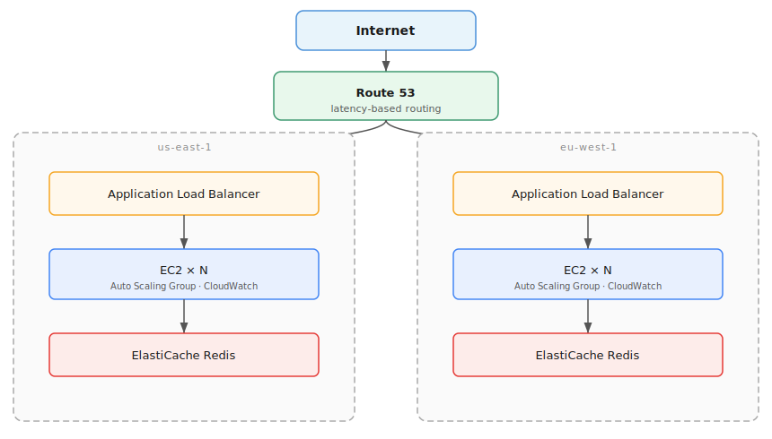

# Part 2: Discussion and Final Result

The questions below cover how this service would behave and evolve in
production: scaling the dataset, deploying on AWS or Kubernetes, keeping
it observable, and shipping changes safely.

---

## 1. The URL list could grow infinitely. How might you scale this beyond memory capacity?

The MVP loads the full URL list into memory at startup. That works up to a
point, but once the dataset exceeds available RAM the process crashes. Loading
more data into memory is not a solution; the lookup model itself has to change.

**The real fix: query a KV store per request**

Instead of loading the entire list into memory, the app queries a KV store on
every lookup. The dataset lives there, not in the process. Memory usage stays
flat regardless of how large the list grows.

Redis is the right choice here. Redis is an in-memory KV store, a fast
dictionary that runs as its own process, outside the app. It fits this use
case well: the dataset changes infrequently (writes only on updates), and it is
easy to run locally with Docker or as a managed service on AWS (ElastiCache).

```text
Request
  -> normalize URL
  -> query Redis
  -> return verdict
```

The `Store` interface in the current code already supports this (verified).
`NewService(store Store)` accepts any value that implements `Contains`. A
`RedisStore` plugs straight in without touching `Service` or the HTTP layer.

<details>
<summary>How to add RedisStore to the codebase</summary>

Add a new file `internal/lookup/redis_store.go`:

```go
package lookup

import (
    "context"

    "github.com/redis/go-redis/v9"
)

type RedisStore struct {
    client *redis.Client
}

func NewRedisStore(addr string) *RedisStore {
    return &RedisStore{
        client: redis.NewClient(&redis.Options{Addr: addr}),
    }
}

// Contains satisfies the Store interface.
func (s *RedisStore) Contains(url string) bool {
    n, err := s.client.Exists(context.Background(), url).Result()
    if err != nil {
        return false // treat errors as safe; log separately
    }
    return n > 0
}
```

Then in `main.go`, swap the store at startup:

```go
// was: store := lookup.NewMemoryStore(urls)
store := lookup.NewRedisStore(cfg.RedisAddr) // e.g. "localhost:6379"
svc := lookup.NewService(store)
```

Nothing else changes. `Service`, `Handler`, and all tests that use
`MemoryStore` keep working as-is.

</details>

---

**Optimization: Bloom filter as a fast-path**

Querying Redis on every request adds a network round-trip. Since most URLs are
safe, most of those round-trips return "not found". A Bloom filter eliminates
the majority of them.

A Bloom filter is a probabilistic data structure built into the app, not a
separate service or script. It is a compact bit array combined with hash
functions. It uses a fraction of the memory of a regular map because it stores
hashes, not the actual URLs.

It has one key property: it can say with certainty that a URL is NOT in the
set, but it can only say a URL MIGHT be in the set (small false-positive rate,
tunable). That asymmetry makes it an efficient gate:

```text
Request
  -> normalize URL
  -> check Bloom filter (~120 MB for 100M entries at 0.1% false-positive rate)
     -> definite miss: return safe immediately, zero external calls
     -> possible hit: query Redis/DynamoDB for exact confirmation
  -> return verdict
```

<details>
<summary>How to add BloomStore to the codebase</summary>

**Step 1: add the dependency:**

```sh
go get github.com/bits-and-blooms/bloom/v3
```

**Step 2: create `internal/lookup/bloom_store.go`:**

```go
package lookup

import (
    "github.com/bits-and-blooms/bloom/v3"
)

type BloomStore struct {
    filter *bloom.BloomFilter
    remote Store  // RedisStore, or any other Store
}

// NewBloomStore builds the filter from the known URL list and wraps the remote store.
func NewBloomStore(urls []string, remote Store) *BloomStore {
    // 1M capacity, 0.1% false-positive rate
    f := bloom.NewWithEstimates(1_000_000, 0.001)
    for _, u := range urls {
        f.AddString(u)
    }
    return &BloomStore{filter: f, remote: remote}
}

// Contains satisfies the Store interface.
func (s *BloomStore) Contains(url string) bool {
    if !s.filter.TestString(url) {
        return false  // definite miss, no Redis call
    }
    return s.remote.Contains(url)  // confirm against Redis
}
```

**Step 3: wire it in `main.go`:**

```go
// Load the URL list once at startup (for the Bloom filter only).
urls, _ := loadURLList(cfg.DataFile)

redisStore := lookup.NewRedisStore(cfg.RedisAddr)
store      := lookup.NewBloomStore(urls, redisStore)  // wraps Redis
svc        := lookup.NewService(store)
```

`Service`, `Handler`, and all existing tests are unchanged.

</details>

---

**Separate concern: dataset lifecycle and persistence**

Keeping the dataset up to date without redeploying the app is a different
problem from memory capacity. When the URL list changes, a script or pipeline
writes the new entries directly to Redis. The app sees the updated data on the
next request with no restart needed.

Redis is in-memory by default. If the process restarts, all data is gone.
The fix is enabling **RDB persistence**: Redis periodically snapshots its
contents to disk and reloads from that file on startup. With RDB on, a
restart is transparent. If the snapshot is also lost (host failure), the
dataset is rebuilt from the original source file by the same pipeline.

---

## 2. Assume request volume exceeds one system. How would you solve this? What changes for another region such as Europe?

The solution is to run multiple instances of url-safety-checker behind a load
balancer, all sharing the same Redis. Because the app holds no session or
local state (every request queries Redis and returns a verdict), so any
instance can handle any request and return the same result. That makes
horizontal scaling straightforward: add more instances when traffic grows,
remove them when it drops.

**Architecture overview**



<details>
<summary>How it is achieved</summary>

The foundation is a **VPC** that splits the network into a public zone (for the
load balancer) and a private zone (for the app and Redis). Without it,
everything would be reachable from the internet by default.

**Security Groups** layer on top: internet traffic can only reach the ALB, the
ALB can only reach the app, and the app can only reach Redis. The VPC creates
the zones; Security Groups enforce who crosses them.

With the private zone secured, **ElastiCache Redis** is deployed there. Every
instance of url-safety-checker queries the same Redis on each request, so the
verdict is always consistent regardless of which instance answers.

With Redis ready and its address known, each **EC2 instance** can be configured
to start and connect to it. Every instance runs the same url-safety-checker
process. They are identical and disposable: if one crashes, it is replaced
automatically. None of them need to know about the others.

Multiple instances running in parallel need something to distribute incoming
requests between them. That is the **ALB (Application Load Balancer)**, the
single public entry point to the whole system. Crucially, the ALB uses the
`/healthz` endpoint the app already exposes: it polls it continuously and stops
sending traffic to any instance that stops responding. The app's health check
becomes the mechanism that keeps the system reliable.

For observability, ALB access logs can be sent to an S3 bucket. This is
disabled by default and requires a bucket policy granting `s3:PutObject` to
the ELB service (`elasticloadbalancing.amazonaws.com`). The ALB is an
AWS-managed service with no IAM role of its own; the bucket policy on the S3
side is all that is needed.

The ALB knows the current state of each instance, but something still needs to
decide how many instances should exist. That is the **Auto Scaling Group**. The
ASG uses the ALB's health data to replace unhealthy instances, and it spreads
them across multiple Availability Zones so a failure in one data center does
not take the whole service down.

The signal that tells the ASG when to adjust comes from **CloudWatch**. It
watches the request volume reported by the ALB and triggers the ASG when
traffic spikes above a threshold or drops below one. Without CloudWatch, the
ASG would hold a fixed instance count and never react to real traffic.

**Route 53** gives the system a stable domain name. Users hit
`lookup.example.com` and never deal with ALB DNS names or instance IPs.
Route 53 resolves that name to the ALB, and the chain is complete.

**Adding a second region (eu-west-1)**

The same stack is deployed in Europe. Route 53 is upgraded to
**latency-based routing**: it measures where the request is coming from and
resolves the domain to whichever region responds faster. A user in Germany
automatically hits the European ALB, with no app change needed.

Each region has its own Redis. When the URL list is updated, the pipeline
writes to both. A new malicious URL may take a few seconds to appear in every
region; acceptable for this use case.

</details>

---

**Alternative: EKS**

If the team already operates containers, the EC2+ASG layer can be replaced
with an EKS Deployment. The VPC, Security Groups, ElastiCache, ALB, and
Route 53 layers stay exactly the same.

- Scaling is a single field: increase `replicas` in the Deployment.
- **HPA** (Horizontal Pod Autoscaler) automates that: same role as CloudWatch+ASG here.
- **KEDA** extends HPA with event-driven triggers: HTTP request rate, Redis
  list length, SQS queue depth, and more. Useful when CPU alone is not the
  right signal to scale on.
- Trade-off: EKS requires managing the cluster, node groups, and Kubernetes
  configuration on top of the application itself.

---

## 3. What strategies would you use to update the service with new URLs?

With Redis as the store, updates are immediate and require no app restart. Each
URL is a key in Redis. Adding a URL is a `SET <url> 1`; removing one is a
`DEL <url>`. The app sees the change on the next request.

**Strategy 1: Lambda + EventBridge (on AWS)**

An EventBridge rule fires a Lambda function every 10 minutes. The Lambda runs
inside the same VPC as ElastiCache so it can reach Redis directly on the
private subnet.

The URL data source is outside the scope of this question. What matters is
the mechanism: the Lambda receives the URL batch, normalizes each entry using
the same rules as the lookup path, and writes to Redis: `SET <url> 1` for
additions, `DEL <url>` for removals. The Lambda deployment package (the
compiled binary) is uploaded to S3 as part of the CI/CD pipeline. That is
the only S3 involvement here.

```text
URL batch available (source outside scope of this question)
EventBridge schedule (every 10 min) → fires Lambda
  → Lambda receives URL batch
  → normalizes URLs
  → writes to ElastiCache Redis
```

At 5,000 URLs/day and a 10-minute cadence, this is roughly 35 URLs per batch.
Lambda handles that in milliseconds and costs essentially nothing at this scale
(well within the AWS free tier at ~4,300 invocations/month).

One critical detail: the Lambda must normalize URLs with the same logic the app
uses at lookup time. A mismatch between how a URL is stored and how it is
queried causes missed detections.

**Strategy 2: Kubernetes CronJob (on EKS)**

If the service runs on Kubernetes, a `CronJob` resource replaces the Lambda.
It runs a container every 10 minutes inside the cluster that normalizes the
URL batch and writes to Redis using `SET <url> 1` for additions and
`DEL <url>` for removals. The implementation can be a shell script with
`redis-cli` or a small Go binary using `go-redis/v9`; either way the image
is built and pushed to ECR (or Docker Hub) separately from the main service.

The pod reaches ElastiCache via Security Group rules, the same way the app
pods do.

**Strategy 3: Admin endpoint (for urgent cases)**

Both strategies above run on a schedule. If a URL needs to be blocked
immediately, waiting for the next cycle is not acceptable.

A `POST /admin/urls` endpoint built into the app handles this: the handler
writes directly to the `RedisStore` the app already holds since startup, so
the change takes effect on the next request with no restart or separate
tooling needed. It should be protected by an API key and only reachable from
within the private network.

---

## 4. You are woken up at 3am. What are some things you would look for in the app?

The answer depends on what observability tools are actually available. The
current MVP exposes `/healthz` and `/readyz` and writes to stdout. Beyond that,
what you can check at 3am depends on where the service is running.

**On AWS (EC2 + ALB)**

These are available without any extra instrumentation:

- **ALB access logs** in S3: HTTP status codes, latency per request, target
  instance, request path. First place to check: tells you if the problem is
  widespread or isolated to one instance.
- **ALB metrics in CloudWatch**: `HTTPCode_Target_5XX_Count`,
  `TargetResponseTime`, `RequestCount`, `HealthyHostCount`. If
  `HealthyHostCount` dropped, instances are failing the `/healthz` check.
- **EC2 instance metrics in CloudWatch**: CPU, memory (with CloudWatch Agent),
  network I/O.
- **ElastiCache metrics in CloudWatch**: `CacheHits`, `CacheMisses`,
  `CurrConnections`, `EngineCPUUtilization`. A Redis issue shows up here.
- **Application logs via CloudWatch Logs**: stdout from each EC2 instance,
  if the CloudWatch Logs agent is installed. Without it, you need to SSH into
  an instance.
- **`/healthz` and `/readyz`** directly via the ALB: a quick curl confirms
  whether the app process is alive. Worth noting: the current `/readyz`
  always returns 200 without checking Redis. It should ping the store before
  reporting ready, so a pod with a broken Redis connection is pulled from
  rotation instead of silently returning wrong verdicts.

**On Kubernetes (EKS)**

Everything above still applies for AWS-managed resources (ALB, ElastiCache).
Inside the cluster, you also have:

- `kubectl get pods` and `kubectl describe pod <name>`: shows restarts,
  OOMKilled events, failed readiness probes.
- `kubectl logs <pod>`: stdout from any pod without needing SSH.
- Pod resource metrics via `kubectl top pods` (if metrics-server is installed).
- If Prometheus is deployed in the cluster, you can query request rate, error
  rate, and latency histograms, but the current app does not expose a
  `/metrics` endpoint yet. That would need to be added.

**What the current app cannot tell you (yet)**

The MVP has no structured logging, no metrics endpoint, and no request
tracing. At 3am on the current implementation, the investigation is limited to
health endpoints, ALB metrics, and raw stdout logs. That is enough to confirm
whether the service is up and whether Redis is reachable, but not enough to
diagnose latency spikes or verdict anomalies. Those require the additions
described in Q5.

---

## 5. Does that change anything you have done in the app?

Yes, significantly. The current app has no structured logging, no metrics
export, and no alerting. It can confirm it is alive via `/healthz` and
`/readyz`, but it cannot tell you what is happening while it runs. For
production, that has to change across three areas.

**Structured logging**

Right now the app writes plain text to stdout. Logs should be structured JSON
so they can be indexed, searched, and filtered. Every request should produce
a log line with at least: timestamp, method, path, status code, latency, and
verdict. URLs in log lines need to be treated carefully: they can contain
sensitive data and should not be logged raw without a clear operational reason.

**Metrics**

The app needs a `/metrics` endpoint that exports counters and histograms:
request count, error count, latency distribution, and verdict counters
(`safe` vs `malicious`). The verdict ratio is particularly useful: a sudden
shift where everything becomes `malicious` or everything becomes `safe` usually
points to a dataset or normalization bug, not a traffic spike.

**On AWS (EC2)**

| Layer | Tool | Role |
|---|---|---|
| Metrics collection | CloudWatch Agent | Scrapes `/metrics` from each instance, pushes to CloudWatch |
| Alerting rules | CloudWatch Alarms | Trigger on 5xx rate, p99 latency, healthy host count |
| Notification bus | SNS Topic | Fans out alarm events to one or more destinations |
| On-call paging | PagerDuty | Receives SNS notifications and pages the on-call engineer |

**On Kubernetes (EKS)**

| Layer | Tool | Role |
|---|---|---|
| Metrics collection | Prometheus | Scrapes `/metrics` from every pod via service discovery |
| Dashboards | Grafana | Visualizes request rate, error rate, latency, verdict ratio |
| Alert routing | Alertmanager | Routes critical alerts to PagerDuty, warnings to Slack |
| On-call paging | PagerDuty | Receives Alertmanager webhooks and pages the on-call engineer |

**What changes in the app code**

- Add a `/metrics` handler using `prometheus/client_golang` that exports the
  counters and histograms above.
- Replace `fmt.Println` with a structured logger (`log/slog` from the standard
  library is sufficient) that emits JSON.
- Add a middleware layer on the HTTP handler that records latency and status
  code for every request and increments the right counters.

`Service`, `Store`, and routing stay unchanged.

---

## 6. What are some considerations for the lifecycle of the app?

Lifecycle is about what happens to the system after it ships: how new versions
reach production safely, how it adapts to breaking changes without disrupting
clients, and how its dependencies are maintained over time.

**Deployment without downtime**

The service handles real traffic continuously. If a new version requires
stopping all running pods before starting the new ones, every request during
that window fails. On Kubernetes, a rolling update avoids this: new pods come
up and pass the readiness probe (`/readyz`) before old pods are terminated.
The Deployment manifest controls the pace via `maxUnavailable` and
`maxSurge`. As long as the readiness probe is meaningful (it confirms Redis is
reachable, not just that the process started), traffic only shifts to a pod
that is genuinely ready to serve.

**Rollback**

A deployment can introduce a bug that was not caught in testing. The rollback
path needs to be fast and not require a new build. On Kubernetes,
`kubectl rollout undo deployment/url-lookup-service` reverts to the previous
ReplicaSet in seconds.

Since the service already runs on Kubernetes, a GitOps approach with **Argo CD**
fits naturally. The Kubernetes manifests live in a Git repository. CI builds
and pushes the new image, then updates the image tag in the manifest. Argo CD
detects the diff between the desired state in Git and the live cluster and
syncs automatically (or on manual approval, depending on the environment).
Every deployment is a Git commit: the history is the audit log, and reverting
a bad deploy is a `git revert` followed by a push, which Argo CD picks up and
applies. No one runs `kubectl apply` by hand in production.

**Monitoring during a rollout**

Deploying a new version and walking away is not enough. The rollout itself is a
risk window. During and immediately after a rolling update, the things to watch
are:

- Error rate in Grafana or CloudWatch: a spike in 5xx responses right after the
  new pods come up is a strong signal that the new version is broken.
- Latency percentiles (p95, p99): a new version can be functionally correct but
  introduce a performance regression that only shows under real traffic.
- Verdict distribution: if the ratio of `malicious` to `safe` shifts suddenly
  after a deploy, it usually points to a normalization bug introduced in the new
  version, not a real threat change.
- Pod restarts via `kubectl get pods`: CrashLoopBackOff on new pods means the
  rollout should be stopped immediately.

The combination of a meaningful readiness probe and these signals gives a short
confirmation window. If nothing looks wrong after a few minutes of traffic, the
rollout is safe. If any signal spikes, `kubectl rollout undo` before the old
pods are fully terminated.

**API versioning**

The endpoint is `/urlinfo/1`. The clients of this service are proxy servers
that call it on every request. If a future version changes the response format
in a breaking way, those proxies break silently or start misinterpreting
verdicts. The `/1` in the path makes a non-breaking migration possible: a new
incompatible contract ships as `/urlinfo/2`, both versions run in parallel
while clients migrate, and `/urlinfo/1` is deprecated and eventually removed.
This is more important here than in most services because the clients are
infrastructure-level components, not user-facing apps.

**Separating the app lifecycle from the dataset lifecycle**

The URL dataset changes continuously: new malicious URLs are added, old ones
are removed. If every dataset update required rebuilding and redeploying the
app image, the deployment rate would be absurd and every update would carry
the risk of introducing an app regression. With Redis as the store, the dataset
is managed independently. The app image only changes when the Go code changes.
Dataset updates happen through the mechanisms described in Q3 (Lambda, CronJob,
or admin endpoint) and take effect immediately without touching the Deployment.

**Redis lifecycle**

Redis is a stateful dependency, which means its lifecycle requires separate
attention from the app's.

- **Upgrades**: ElastiCache supports in-place engine version upgrades with
  automatic failover if Multi-AZ is enabled. The upgrade triggers a primary
  failover: the replica becomes the new primary, the app reconnects via the
  same endpoint, and the outage window is a few seconds. This should be tested
  in a staging environment before production.

- **Persistence and recovery**: with RDB snapshots enabled, Redis can restore
  its dataset after a restart. Without this, a Redis crash means the URL list
  is gone and lookups return `safe` for everything until the next sync job
  runs. The sync job should also run on startup to ensure Redis is populated
  before the app starts serving traffic.

- **Storage migration**: the `Store` interface in the app (`Contains(url string) bool`)
  means Redis is not hardcoded into the lookup path. If the store backend needs
  to change (different Redis cluster, different technology), the migration is:
  populate the new store, deploy a new `Store` implementation, cut over. No
  changes to `Service` or the HTTP handler.

**Dependency and security updates**

The app has few Go dependencies today. Over time, vulnerabilities are
discovered in dependencies. `govulncheck` and `go mod tidy` should run in CI
on every pull request. Container base images also need periodic updates; a
pinned `FROM golang:1.26` will eventually contain unpatched CVEs. The CI
pipeline should rebuild and push a new image on a regular schedule even if
the app code has not changed.

---

## 7. You need to deploy a new version of this application. What would you do?

The answer is: open a pull request and let the pipeline do the rest.

```
PR opened
  → Stage 1: Lint           (golangci-lint)
  → Stage 2: Test           (go test -race -cover)
  → Stage 3: Security scan  (govulncheck + trivy)
  → PR reviewed and merged to main
  → Stage 4: Build and push (image tagged with Git SHA, pushed to Docker Hub)
  → Stage 5: Manifest repo updated with new image tag
  → Argo CD detects diff, syncs to cluster
  → Argo Rollouts starts canary: 10% traffic to new pods
      → analysis: error rate, p99 latency, verdict ratio
      → passing → 25% → 50% → 100% → promote
      → failing → automatic rollback
  → Stage 6: Post-deploy monitoring (Grafana dashboards)
```

Each tool has a single responsibility and they communicate only through Git:

| Tool | Responsibility |
|---|---|
| GitHub Actions | Lint, test, security scan, build, push image, update manifest tag |
| Argo CD | Detect manifest diff, sync desired state to the cluster |
| Argo Rollouts | Manage canary traffic shifting, run analysis, promote or rollback |

**Stage 1: Lint**

`golangci-lint run` catches style issues, dead code, and common Go mistakes. Runs on every PR. A PR that fails lint does not get reviewed.

**Stage 2: Test**

`go test ./... -race -cover` — `-race` catches data race conditions, `-cover`
produces a coverage report. A coverage drop on a PR is a signal worth
reviewing before merging.

The test suite covers: health and readiness endpoints, URL lookup verdicts
(malicious and safe), query string and escaped path preservation, malformed
path rejection, URL normalization rules (host lowercasing, port, path and
query case), dataset loading, and the `MemoryStore` and `Service` layers
independently.

**Stage 3: Security scan**

Two layers:

- `govulncheck ./...`: checks Go dependencies against the Go vulnerability database.
- `trivy image`: scans the built container image for OS and dependency CVEs before it reaches the registry.

**Stage 4: Build and push**

On merge to main only. The image is tagged with the Git SHA: `maxlef/url-safety-checker:<sha>`. Never `:latest` in production — it makes rollback unreliable and breaks traceability.

**Stage 5: Deploy via Argo CD + Argo Rollouts**

The pipeline updates the image tag in the manifest repository. Argo CD detects the diff and applies it. Because the Deployment is defined as an Argo `Rollout` resource, Argo Rollouts takes over: it starts the canary at 10% traffic and evaluates Prometheus metrics (error rate, p99 latency, verdict ratio) at each step as automated promotion gates. If any threshold is breached, the rollout pauses or rolls back without human intervention.

**Stage 6: Post-deploy monitoring**

After the canary reaches 100%, the Grafana dashboards confirm the new version is stable under full traffic. At this point the deploy is considered complete.

**Rollback**

With Argo Rollouts, a failing canary is rolled back automatically before it reaches full traffic. If a problem is discovered after promotion, a `git revert` on the image tag in the manifest repo is enough: Argo CD picks it up and syncs back to the previous version. The bad commit stays in history; nothing is force-pushed or lost.

---

The published image is available at:
[hub.docker.com/r/maxlef/url-safety-checker](https://hub.docker.com/r/maxlef/url-safety-checker)
